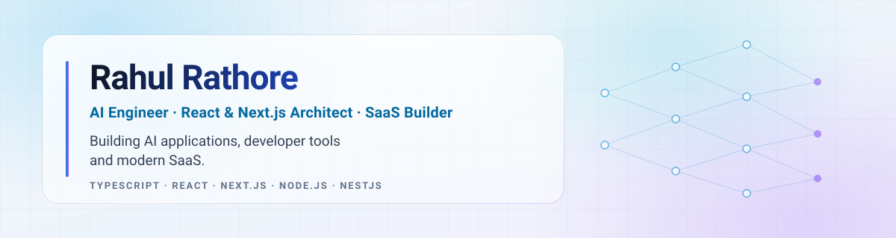

# Rahul Rocket

<picture>
  <source media="(prefers-color-scheme: dark)" srcset="assets/banner/profile-banner-dark.svg">
  <source media="(prefers-color-scheme: light)" srcset="assets/banner/profile-banner-light.svg">
  
</picture>

Building open-source business platforms at [@ever-co](https://github.com/ever-co) · Ahmedabad, India

[Website](https://rahul-rocket.github.io) ·
[LinkedIn](https://www.linkedin.com/in/rahul-rathore-940380108/) ·
[GitHub](https://github.com/rahul-rocket) ·
[Upwork](https://www.upwork.com/freelancers/~01192228420671270c)

---

## About

I build web applications end to end — from the API and data layer up to the
interface people actually use. Most of my work sits in the TypeScript
ecosystem: **Angular** on the front end, **NestJS** and **Node.js** on the back
end, with **PHP/Laravel** in earlier chapters of my career.

- **Full stack development** — Angular front ends backed by NestJS/Express APIs, REST and GraphQL.
- **SaaS & business platforms** — core development on ERP/CRM/HRM products at [Ever Co.](https://github.com/ever-co).
- **Open source** — contributions to Ever Gauzy, Ever Gauzy Teams, and Angular ecosystem libraries.
- **Developer tools** — reusable NestJS modules, such as a dual TypeORM/MikroORM integration.
- **Integrations** — third-party APIs and payment gateways.

<!--
  TODO (Rahul): the modernization brief also asked to highlight AI Engineering,
  Cloud, and DevOps. Nothing in this account's public repositories or profile
  evidences those yet, so they have deliberately been left out rather than
  invented. Add them here (and to the Skills table below) once there is public
  work to point at.
-->

## Currently

- Building **[rahul-rocket.github.io](https://github.com/rahul-rocket/rahul-rocket.github.io)** — a statically exported Next.js personal site with its own design system, test suite, and accessibility budgets.
- Core development on **[Ever Gauzy](https://github.com/ever-co/ever-gauzy)**, an open-source ERP/CRM/HRM platform.

## Featured Projects

### [rahul-rocket.github.io](https://github.com/rahul-rocket/rahul-rocket.github.io)

Personal website and professional record — a statically exported Next.js site
built as a product: typed content model, design system, per-route byte budgets,
unit and end-to-end tests, and axe accessibility checks on every route in both
themes.

- **Stack** · TypeScript, Next.js
- **Live** · <https://rahul-rocket.github.io>
- **Status** · Active — built, gated on content review before it is indexed

---

### [nestjs-multi-orm](https://github.com/rahul-rocket/nestjs-multi-orm)

A NestJS module that integrates **TypeORM and MikroORM** in the same project —
configurable per ORM, with repository-pattern abstractions and custom decorators
for injecting repositories.

- **Stack** · TypeScript, NestJS, TypeORM, MikroORM
- **Status** · Paused — last updated April 2024

---

<!--
  TODO (Rahul): https://github.com/rahul-rocket/gpt-chatbot has no description
  and its README is a single heading, so there is nothing factual to write a
  card from. Fill in a one-line description, stack, and status — or leave it
  out of the featured list.
-->

## Open Source Contributions

| Project | Role |
| --- | --- |
| [Ever Gauzy](https://github.com/ever-co/ever-gauzy) — open-source ERP/CRM/HRM platform | Core developer |
| [Ever Gauzy Teams](https://github.com/ever-co/ever-gauzy-teams) — work & project management platform | Backend API developer |
| [ngx-daterangepicker-material](https://github.com/fetrarij/ngx-daterangepicker-material) | UI fix (empty ranges) |

## Skills

| Category | Technologies |
| --- | --- |
| **Languages** | TypeScript, JavaScript, PHP |
| **Frontend** | Angular, Angular Material, React, HTML, CSS, Bootstrap |
| **Backend** | NestJS, Node.js, Express, RxJS, Laravel, Lumen, CodeIgniter |
| **Databases** | PostgreSQL, MySQL, MongoDB, SQLite |
| **APIs** | REST, GraphQL, third-party & payment gateway integrations |
| **Tooling** | Git, GitHub, GitLab, GitHub Actions |

<!--
  TODO (Rahul): add Cloud, DevOps, AI and Testing rows here when applicable.
  They were intentionally omitted rather than guessed.
-->

## GitHub

<picture>
  <source media="(prefers-color-scheme: dark)" srcset="https://github-readme-stats.vercel.app/api?username=rahul-rocket&show_icons=true&hide_border=true&theme=github_dark&card_width=450">
  
</picture>

<picture>
  <source media="(prefers-color-scheme: dark)" srcset="https://github-readme-stats.vercel.app/api/top-langs/?username=rahul-rocket&layout=compact&hide_border=true&theme=github_dark&card_width=450">
  
</picture>

<picture>
  <source media="(prefers-color-scheme: dark)" srcset="https://streak-stats.demolab.com/?user=rahul-rocket&hide_border=true&theme=github-dark">
  
</picture>

<picture>
  <source media="(prefers-color-scheme: dark)" srcset="https://github-readme-activity-graph.vercel.app/graph?username=rahul-rocket&hide_border=true&theme=github-compact">
  
</picture>

### 🐍 Contribution Snake Graph

<picture>
  <source media="(prefers-color-scheme: dark)" srcset="https://raw.githubusercontent.com/rahul-rocket/rahul-rocket/output/github-contribution-grid-snake-dark.svg">
  <source media="(prefers-color-scheme: light)" srcset="https://raw.githubusercontent.com/rahul-rocket/rahul-rocket/output/github-contribution-grid-snake.svg">
  
</picture>

<!--
  TODO (Rahul): a lowlighter/metrics panel is wired up in
  .github/workflows/metrics.yml but stays skipped until you add a METRICS_TOKEN
  secret. Once it runs and commits assets/metrics/metrics.svg, add it here:
  
-->

---

## 📫 Get in Touch

- **Website** — <https://rahul-rocket.github.io>
- **LinkedIn** — [rahul-rathore-940380108](https://www.linkedin.com/in/rahul-rathore-940380108/)
- **GitHub** — [@rahul-rocket](https://github.com/rahul-rocket)
- **Upwork** — [Hire me](https://www.upwork.com/freelancers/~01192228420671270c)

<!--
  Preserved from the previous README — uncomment any of these to publish them again.
  - **GitLab** — [rahulrathore576](https://gitlab.com/rahulrathore576)
  - **Stack Overflow** — [rahul-rathore](https://stackoverflow.com/users/11013906/rahul-rathore)
  - **Email** — <mailto:rahulrathore576@gmail.com>
  - **Twitter** — [@rahulrathore576](https://twitter.com/rahulrathore576)
  - **Freelancer** — [rahulrathore576](https://www.freelancer.in/u/rahulrathore576)
-->

Feel free to explore my repositories and connect with me. Let's collaborate and
create something amazing together!
